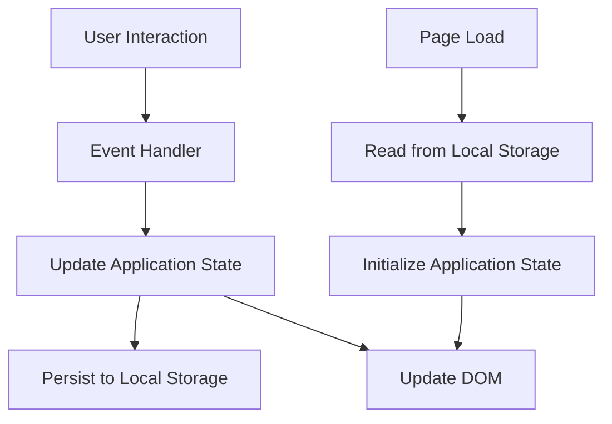

# Design Document: Productivity Dashboard

## Overview

The Productivity Dashboard is a single-page web application built with vanilla JavaScript, HTML, and CSS that provides time management and task tracking capabilities. The application runs entirely in the browser with no backend dependencies, using the Local Storage API for data persistence.

### Key Features

- Personalized time-based greeting display
- Focus timer with standard and Pomodoro modes
- Task management with CRUD operations
- Quick links for favorite websites
- Light/dark theme switching
- Automatic data persistence via Local Storage

### Technology Stack

- HTML5 for semantic structure
- CSS3 for styling and theming
- Vanilla JavaScript (ES6+) for application logic
- Local Storage API for client-side persistence
- No external frameworks or libraries

## Architecture

### Application Structure

The application follows a modular architecture with clear separation of concerns:

```
productivity-dashboard/
├── index.html          # Main HTML structure
├── css/
│   └── styles.css      # All styling and theme definitions
└── js/
    └── app.js          # All application logic
```


### Architectural Patterns

**Module Pattern**: JavaScript code is organized into logical modules using IIFE (Immediately Invoked Function Expressions) or ES6 modules to encapsulate functionality and prevent global namespace pollution.

**Observer Pattern**: The timer component uses event-driven updates to notify the UI when the countdown changes or completes.

**MVC-inspired Structure**:
- Model: Data management (tasks, links, theme preferences) via Local Storage
- View: DOM manipulation and rendering
- Controller: Event handlers and business logic

### Data Flow



## Components and Interfaces

### 1. Greeting Component

**Responsibility**: Display personalized greeting with current time and date

**State**:
- Current time (updated every second)
- Current date
- Greeting message based on time of day

**Methods**:
- `updateGreeting()`: Updates time, date, and greeting message
- `getGreetingMessage(hour)`: Returns appropriate greeting based on hour
- `formatTime(date)`: Formats time in 12-hour format with AM/PM
- `formatDate(date)`: Formats date in readable format


**Interface**:
```javascript
GreetingComponent {
  init(): void
  updateGreeting(): void
  getGreetingMessage(hour: number): string
  formatTime(date: Date): string
  formatDate(date: Date): string
}
```

### 2. Timer Component

**Responsibility**: Manage focus timer and Pomodoro timer functionality

**State**:
- `timeRemaining`: Seconds remaining on timer
- `isRunning`: Boolean indicating if timer is active
- `mode`: 'focus' or 'pomodoro'
- `intervalId`: Reference to setInterval for cleanup

**Methods**:
- `start()`: Begin countdown
- `stop()`: Pause countdown
- `reset()`: Reset to initial duration (25 minutes)
- `tick()`: Decrement time and update display
- `switchMode(mode)`: Toggle between focus and Pomodoro modes
- `formatDisplay(seconds)`: Convert seconds to MM:SS format
- `onComplete()`: Handle timer completion

**Interface**:
```javascript
TimerComponent {
  init(): void
  start(): void
  stop(): void
  reset(): void
  tick(): void
  switchMode(mode: string): void
  formatDisplay(seconds: number): string
  onComplete(): void
}
```


### 3. Task Manager Component

**Responsibility**: Handle CRUD operations for tasks and manage task list state

**State**:
- `tasks`: Array of task objects `[{id, text, completed}]`

**Methods**:
- `addTask(text)`: Add new task to list
- `editTask(id, newText)`: Update task text
- `toggleTask(id)`: Mark task as done/undone
- `deleteTask(id)`: Remove task from list
- `sortTasks()`: Sort tasks alphabetically by text
- `isDuplicate(text)`: Check if task text already exists
- `render()`: Update DOM with current task list
- `save()`: Persist tasks to Local Storage
- `load()`: Retrieve tasks from Local Storage

**Interface**:
```javascript
TaskManager {
  init(): void
  addTask(text: string): boolean
  editTask(id: string, newText: string): void
  toggleTask(id: string): void
  deleteTask(id: string): void
  sortTasks(): void
  isDuplicate(text: string): boolean
  render(): void
  save(): void
  load(): void
}
```

### 4. Quick Links Component

**Responsibility**: Manage favorite website links

**State**:
- `links`: Array of link objects `[{id, label, url}]`

**Methods**:
- `addLink(label, url)`: Add new quick link
- `deleteLink(id)`: Remove quick link
- `openLink(url)`: Open URL in new tab
- `render()`: Update DOM with current links
- `save()`: Persist links to Local Storage
- `load()`: Retrieve links from Local Storage


**Interface**:
```javascript
QuickLinksComponent {
  init(): void
  addLink(label: string, url: string): void
  deleteLink(id: string): void
  openLink(url: string): void
  render(): void
  save(): void
  load(): void
}
```

### 5. Theme Manager Component

**Responsibility**: Handle theme switching and persistence

**State**:
- `currentTheme`: 'light' or 'dark'

**Methods**:
- `toggleTheme()`: Switch between light and dark themes
- `applyTheme(theme)`: Apply theme to DOM
- `save()`: Persist theme preference to Local Storage
- `load()`: Retrieve theme preference from Local Storage

**Interface**:
```javascript
ThemeManager {
  init(): void
  toggleTheme(): void
  applyTheme(theme: string): void
  save(): void
  load(): void
}
```

### 6. Storage Service

**Responsibility**: Abstract Local Storage operations

**Methods**:
- `get(key)`: Retrieve and parse data from Local Storage
- `set(key, value)`: Stringify and save data to Local Storage
- `remove(key)`: Delete data from Local Storage
- `clear()`: Clear all Local Storage data


**Interface**:
```javascript
StorageService {
  get(key: string): any
  set(key: string, value: any): void
  remove(key: string): void
  clear(): void
}
```

## Data Models

### Task Model

```javascript
{
  id: string,           // Unique identifier (timestamp or UUID)
  text: string,         // Task description
  completed: boolean,   // Completion status
  createdAt: number     // Timestamp of creation
}
```

**Validation Rules**:
- `text`: Non-empty string, trimmed
- `completed`: Boolean, defaults to false
- `id`: Must be unique within task list

### Quick Link Model

```javascript
{
  id: string,      // Unique identifier
  label: string,   // Display text for button
  url: string      // Valid URL
}
```

**Validation Rules**:
- `label`: Non-empty string
- `url`: Valid URL format (http:// or https://)

### Theme Model

```javascript
{
  theme: 'light' | 'dark'  // Current theme selection
}
```

### Timer State Model

```javascript
{
  timeRemaining: number,    // Seconds remaining
  isRunning: boolean,       // Timer active state
  mode: 'focus' | 'pomodoro'  // Timer mode
}
```


### Local Storage Keys

```javascript
const STORAGE_KEYS = {
  TASKS: 'productivity_dashboard_tasks',
  LINKS: 'productivity_dashboard_links',
  THEME: 'productivity_dashboard_theme'
};
```

## Correctness Properties


*A property is a characteristic or behavior that should hold true across all valid executions of a system—essentially, a formal statement about what the system should do. Properties serve as the bridge between human-readable specifications and machine-verifiable correctness guarantees.*

### Property 1: Time Format Consistency

*For any* Date object, the formatted time output should match the 12-hour format pattern with AM/PM indicator (e.g., "3:45 PM", "11:30 AM").

**Validates: Requirements 1.1**

### Property 2: Date Format Consistency

*For any* Date object, the formatted date output should contain month, day, and year in a readable format.

**Validates: Requirements 1.2**

### Property 3: Greeting Message Correctness

*For any* hour of the day (0-23), the greeting message should match the expected greeting based on time ranges: "Good morning, Faris" (5-11), "Good afternoon, Faris" (12-16), "Good evening, Faris" (17-20), or "Good night, Faris" (21-4).

**Validates: Requirements 1.3, 1.4, 1.5, 1.6**

### Property 4: Timer Display Format

*For any* number of seconds (0 to 1500), the timer display should be formatted as MM:SS with zero-padding (e.g., "25:00", "03:45", "00:00").

**Validates: Requirements 2.6**


### Property 5: Timer Stop Preserves State

*For any* timer state with time remaining, stopping the timer should preserve the exact time remaining without any change.

**Validates: Requirements 2.3**

### Property 6: Timer Reset Returns to Initial State

*For any* timer state, resetting should return the time remaining to 25 minutes (1500 seconds).

**Validates: Requirements 2.4**

### Property 7: Mode Switching Preserves Timer Controls

*For any* timer mode (focus or pomodoro), switching modes should maintain the availability of start, stop, and reset controls.

**Validates: Requirements 3.1, 3.3**

### Property 8: Task Addition Increases List Size

*For any* task list and any valid (non-empty, non-duplicate) task text, adding the task should increase the list length by exactly one.

**Validates: Requirements 4.1**

### Property 9: Duplicate Task Prevention

*For any* task list and any task text that already exists in the list, attempting to add a duplicate should fail and leave the list unchanged.

**Validates: Requirements 4.2**

### Property 10: Task Edit Updates Text

*For any* task and any new valid text, editing the task should update its text property while preserving its id and completed status.

**Validates: Requirements 4.3**


### Property 11: Task Completion Toggle

*For any* task, marking it as done should set its completed property to true, and the task should remain in the list with all other properties unchanged.

**Validates: Requirements 4.4**

### Property 12: Task Deletion Removes Task

*For any* task list and any task id in that list, deleting the task should remove it from the list and decrease the list length by exactly one.

**Validates: Requirements 4.5**

### Property 13: Task List Rendering Completeness

*For any* task list, all tasks in the list should appear in the rendered DOM output.

**Validates: Requirements 4.6**

### Property 14: Alphabetical Sort Ordering

*For any* task list, sorting alphabetically should result in tasks ordered by text property in ascending lexicographic order.

**Validates: Requirements 4.7**

### Property 15: Task Persistence Round-Trip

*For any* task list, saving to Local Storage and then loading should produce an equivalent task list with all tasks preserved.

**Validates: Requirements 5.1, 5.2, 5.3, 5.4, 5.5**

### Property 16: Quick Link Rendering Completeness

*For any* list of quick links, all links should appear as buttons in the rendered DOM output.

**Validates: Requirements 6.1**


### Property 17: Quick Link Addition

*For any* valid label and URL, adding a quick link should increase the links list length by exactly one and the new link should contain the provided label and URL.

**Validates: Requirements 6.6**

### Property 18: Quick Link Deletion

*For any* links list and any link id in that list, deleting the link should remove it from the list and decrease the list length by exactly one.

**Validates: Requirements 6.7**

### Property 19: Quick Link Persistence Round-Trip

*For any* list of quick links, saving to Local Storage and then loading should produce an equivalent links list with all links preserved.

**Validates: Requirements 6.3, 6.4, 6.5**

### Property 20: Theme Toggle Behavior

*For any* current theme state (light or dark), toggling the theme should switch to the opposite theme.

**Validates: Requirements 7.2, 7.3**

### Property 21: Theme Persistence Round-Trip

*For any* theme selection (light or dark), saving to Local Storage and then loading should preserve the same theme value.

**Validates: Requirements 7.4, 7.5**

## Error Handling

### Input Validation

**Task Text Validation**:
- Empty strings (after trimming) are rejected
- Duplicate task text is rejected
- Maximum length limit (e.g., 500 characters) to prevent storage issues


**Quick Link Validation**:
- Label must be non-empty string
- URL must be valid format (http:// or https://)
- URL validation using URL constructor or regex pattern

**Timer Validation**:
- Time values must be non-negative integers
- Mode must be either 'focus' or 'pomodoro'

### Local Storage Error Handling

**Storage Quota Exceeded**:
```javascript
try {
  localStorage.setItem(key, value);
} catch (e) {
  if (e.name === 'QuotaExceededError') {
    // Display user-friendly error message
    // Suggest clearing old data
    console.error('Storage quota exceeded');
  }
}
```

**Corrupted Data**:
```javascript
try {
  const data = JSON.parse(localStorage.getItem(key));
  // Validate data structure
  if (!isValidData(data)) {
    throw new Error('Invalid data structure');
  }
  return data;
} catch (e) {
  console.error('Failed to load data, using defaults');
  return getDefaultData();
}
```

**Missing Data**:
- When Local Storage key doesn't exist, initialize with sensible defaults
- Tasks: empty array `[]`
- Links: empty array `[]`
- Theme: 'light'


### Browser Compatibility Errors

**Unsupported Features**:
- Check for Local Storage availability before use
- Provide fallback message if Local Storage is disabled
- Graceful degradation for older browsers

```javascript
function isLocalStorageAvailable() {
  try {
    const test = '__storage_test__';
    localStorage.setItem(test, test);
    localStorage.removeItem(test);
    return true;
  } catch (e) {
    return false;
  }
}
```

### User Feedback

**Error Messages**:
- Display clear, non-technical error messages to users
- Use toast notifications or inline validation messages
- Provide actionable guidance (e.g., "Task already exists. Please use a different name.")

**Success Feedback**:
- Visual confirmation for successful operations (e.g., task added, theme changed)
- Smooth transitions and animations for state changes

## Testing Strategy

### Overview

The testing strategy employs a dual approach combining unit tests for specific scenarios and property-based tests for comprehensive validation of universal behaviors. This ensures both concrete correctness and general robustness across all possible inputs.

### Testing Framework Selection

**Unit Testing**: Jest or Mocha with Chai for assertion library
**Property-Based Testing**: fast-check (JavaScript property-based testing library)
**Test Runner**: Jest (provides both unit and integration testing capabilities)
**DOM Testing**: jsdom for simulating browser environment in tests

### Unit Testing Approach

Unit tests focus on:
- Specific examples demonstrating correct behavior
- Edge cases (empty inputs, boundary values, special characters)
- Error conditions and validation failures
- Integration points between components
- DOM manipulation and event handling

**Example Unit Tests**:

```javascript
// Greeting component
test('displays correct greeting at 10 AM', () => {
  const greeting = getGreetingMessage(10);
  expect(greeting).toBe('Good morning, Faris');
});

test('handles midnight edge case', () => {
  const greeting = getGreetingMessage(0);
  expect(greeting).toBe('Good night, Faris');
});

// Task manager
test('rejects empty task text', () => {
  const result = taskManager.addTask('   ');
  expect(result).toBe(false);
  expect(taskManager.tasks.length).toBe(0);
});

test('handles Local Storage unavailability', () => {
  // Mock localStorage to throw error
  expect(() => taskManager.save()).not.toThrow();
});
```

### Property-Based Testing Approach

Property-based tests validate universal properties across randomly generated inputs. Each test runs a minimum of 100 iterations to ensure comprehensive coverage.

**Configuration**:
- Minimum 100 iterations per property test
- Each test tagged with feature name and property reference
- Custom generators for domain-specific data (tasks, links, dates)

**Property Test Examples**:

```javascript
const fc = require('fast-check');

// Feature: productivity-dashboard, Property 1: Time Format Consistency
test('time formatting produces valid 12-hour format', () => {
  fc.assert(
    fc.property(
      fc.date(),
      (date) => {
        const formatted = formatTime(date);
        const pattern = /^(0?[1-9]|1[0-2]):[0-5][0-9] (AM|PM)$/;
        return pattern.test(formatted);
      }
    ),
    { numRuns: 100 }
  );
});

// Feature: productivity-dashboard, Property 3: Greeting Message Correctness
test('greeting message matches time of day', () => {
  fc.assert(
    fc.property(
      fc.integer({ min: 0, max: 23 }),
      (hour) => {
        const greeting = getGreetingMessage(hour);
        if (hour >= 5 && hour <= 11) {
          return greeting === 'Good morning, Faris';
        } else if (hour >= 12 && hour <= 16) {
          return greeting === 'Good afternoon, Faris';
        } else if (hour >= 17 && hour <= 20) {
          return greeting === 'Good evening, Faris';
        } else {
          return greeting === 'Good night, Faris';
        }
      }
    ),
    { numRuns: 100 }
  );
});

// Feature: productivity-dashboard, Property 4: Timer Display Format
test('timer display format is always MM:SS', () => {
  fc.assert(
    fc.property(
      fc.integer({ min: 0, max: 1500 }),
      (seconds) => {
        const display = formatDisplay(seconds);
        const pattern = /^[0-9]{2}:[0-5][0-9]$/;
        return pattern.test(display);
      }
    ),
    { numRuns: 100 }
  );
});

// Feature: productivity-dashboard, Property 8: Task Addition Increases List Size
test('adding valid task increases list size by one', () => {
  fc.assert(
    fc.property(
      fc.array(fc.record({ id: fc.uuid(), text: fc.string(), completed: fc.boolean() })),
      fc.string({ minLength: 1 }).filter(s => s.trim().length > 0),
      (initialTasks, newTaskText) => {
        const manager = new TaskManager();
        manager.tasks = [...initialTasks];
        const initialLength = manager.tasks.length;
        
        // Ensure no duplicate
        if (manager.isDuplicate(newTaskText)) {
          return true; // Skip this case
        }
        
        manager.addTask(newTaskText);
        return manager.tasks.length === initialLength + 1;
      }
    ),
    { numRuns: 100 }
  );
});

// Feature: productivity-dashboard, Property 9: Duplicate Task Prevention
test('duplicate tasks are rejected', () => {
  fc.assert(
    fc.property(
      fc.string({ minLength: 1 }).filter(s => s.trim().length > 0),
      (taskText) => {
        const manager = new TaskManager();
        manager.addTask(taskText);
        const lengthAfterFirst = manager.tasks.length;
        
        manager.addTask(taskText); // Try to add duplicate
        return manager.tasks.length === lengthAfterFirst;
      }
    ),
    { numRuns: 100 }
  );
});

// Feature: productivity-dashboard, Property 14: Alphabetical Sort Ordering
test('sorted tasks are in lexicographic order', () => {
  fc.assert(
    fc.property(
      fc.array(fc.record({ 
        id: fc.uuid(), 
        text: fc.string({ minLength: 1 }), 
        completed: fc.boolean() 
      })),
      (tasks) => {
        const manager = new TaskManager();
        manager.tasks = [...tasks];
        manager.sortTasks();
        
        // Check if sorted
        for (let i = 0; i < manager.tasks.length - 1; i++) {
          if (manager.tasks[i].text > manager.tasks[i + 1].text) {
            return false;
          }
        }
        return true;
      }
    ),
    { numRuns: 100 }
  );
});

// Feature: productivity-dashboard, Property 15: Task Persistence Round-Trip
test('task list round-trips through storage', () => {
  fc.assert(
    fc.property(
      fc.array(fc.record({ 
        id: fc.uuid(), 
        text: fc.string({ minLength: 1 }), 
        completed: fc.boolean(),
        createdAt: fc.integer()
      })),
      (tasks) => {
        const manager = new TaskManager();
        manager.tasks = tasks;
        manager.save();
        
        const newManager = new TaskManager();
        newManager.load();
        
        return JSON.stringify(newManager.tasks) === JSON.stringify(tasks);
      }
    ),
    { numRuns: 100 }
  );
});

// Feature: productivity-dashboard, Property 20: Theme Toggle Behavior
test('theme toggle switches to opposite theme', () => {
  fc.assert(
    fc.property(
      fc.constantFrom('light', 'dark'),
      (initialTheme) => {
        const themeManager = new ThemeManager();
        themeManager.currentTheme = initialTheme;
        themeManager.toggleTheme();
        
        const expectedTheme = initialTheme === 'light' ? 'dark' : 'light';
        return themeManager.currentTheme === expectedTheme;
      }
    ),
    { numRuns: 100 }
  );
});
```

### Custom Generators

**Task Generator**:
```javascript
const taskArbitrary = fc.record({
  id: fc.uuid(),
  text: fc.string({ minLength: 1, maxLength: 500 }).filter(s => s.trim().length > 0),
  completed: fc.boolean(),
  createdAt: fc.integer({ min: 0 })
});
```

**Quick Link Generator**:
```javascript
const urlArbitrary = fc.webUrl();
const quickLinkArbitrary = fc.record({
  id: fc.uuid(),
  label: fc.string({ minLength: 1, maxLength: 50 }),
  url: urlArbitrary
});
```

### Integration Testing

**Component Integration**:
- Test interactions between Timer and DOM updates
- Test Task Manager save/load with Storage Service
- Test Theme Manager applying themes to DOM

**End-to-End Scenarios**:
- Complete user workflow: add task → mark done → delete
- Timer workflow: start → stop → reset
- Theme persistence: change theme → reload page → verify theme

### Performance Testing

**Timing Constraints** (from Requirement 8):
- Initial load time: < 2 seconds
- User interaction feedback: < 100ms
- Task operations: < 100ms
- Theme switching: < 100ms
- Timer updates: every 1 second without lag

**Performance Test Approach**:
- Use `performance.now()` to measure operation timing
- Test with large datasets (e.g., 1000 tasks) to ensure scalability
- Monitor DOM manipulation performance

```javascript
test('task addition completes within 100ms', () => {
  const manager = new TaskManager();
  const start = performance.now();
  manager.addTask('Test task');
  const end = performance.now();
  expect(end - start).toBeLessThan(100);
});
```

### Browser Compatibility Testing

**Manual Testing Matrix**:
- Chrome (latest version)
- Firefox (latest version)
- Edge (latest version)
- Safari (latest version)

**Automated Cross-Browser Testing**:
- Use Playwright or Selenium for automated browser testing
- Test core functionality in each browser
- Verify Local Storage behavior across browsers

### Test Coverage Goals

- Unit test coverage: > 80% of code lines
- Property test coverage: All 21 correctness properties implemented
- Integration test coverage: All component interactions
- Browser compatibility: All 4 major browsers

### Continuous Integration

**CI Pipeline**:
1. Run unit tests on every commit
2. Run property-based tests (with reduced iterations for speed)
3. Run linting and code quality checks
4. Generate coverage reports
5. Fail build if coverage drops below threshold

### Test Organization

```
tests/
├── unit/
│   ├── greeting.test.js
│   ├── timer.test.js
│   ├── taskManager.test.js
│   ├── quickLinks.test.js
│   ├── themeManager.test.js
│   └── storage.test.js
├── properties/
│   ├── greeting.properties.test.js
│   ├── timer.properties.test.js
│   ├── taskManager.properties.test.js
│   ├── quickLinks.properties.test.js
│   └── themeManager.properties.test.js
├── integration/
│   └── workflows.test.js
└── helpers/
    └── generators.js
```

### Testing Best Practices

1. **Isolation**: Each test should be independent and not rely on other tests
2. **Cleanup**: Reset state between tests (clear Local Storage, reset DOM)
3. **Mocking**: Mock Local Storage and timers where appropriate
4. **Descriptive Names**: Test names should clearly describe what is being tested
5. **Arrange-Act-Assert**: Follow AAA pattern for test structure
6. **Edge Cases**: Explicitly test boundary conditions and error paths
7. **Property Tags**: Every property test must include the feature and property reference in a comment

